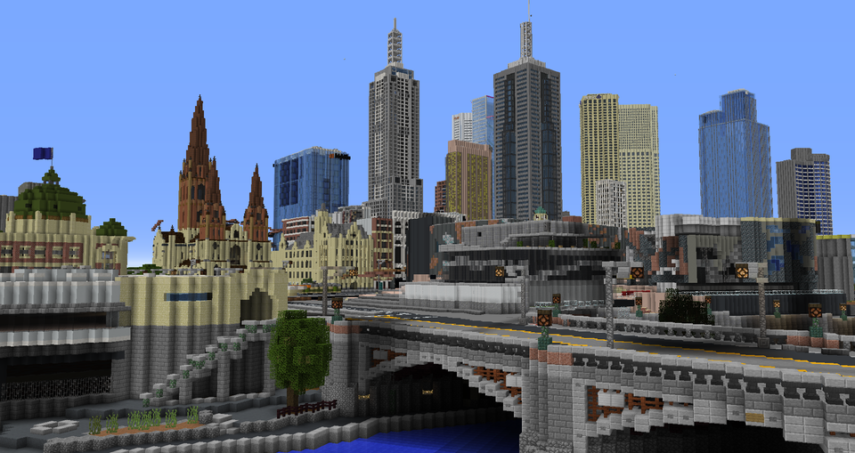

# Week 1 Code + Words
Andy and Karen introduced us to CodeWords and a brief background on what projects they have been doing (So many cool ones!). We also got to discuss on the differences between how we read digitally and on paper. The things we read on a daily bases like how we get our information these days have changed dramatically. We found out that the majority reads any kind of information through social media, like Twitter and Instagram. 

### Mini Melbourne

Due to this pandemic, we arent able to gather physically. 

 
