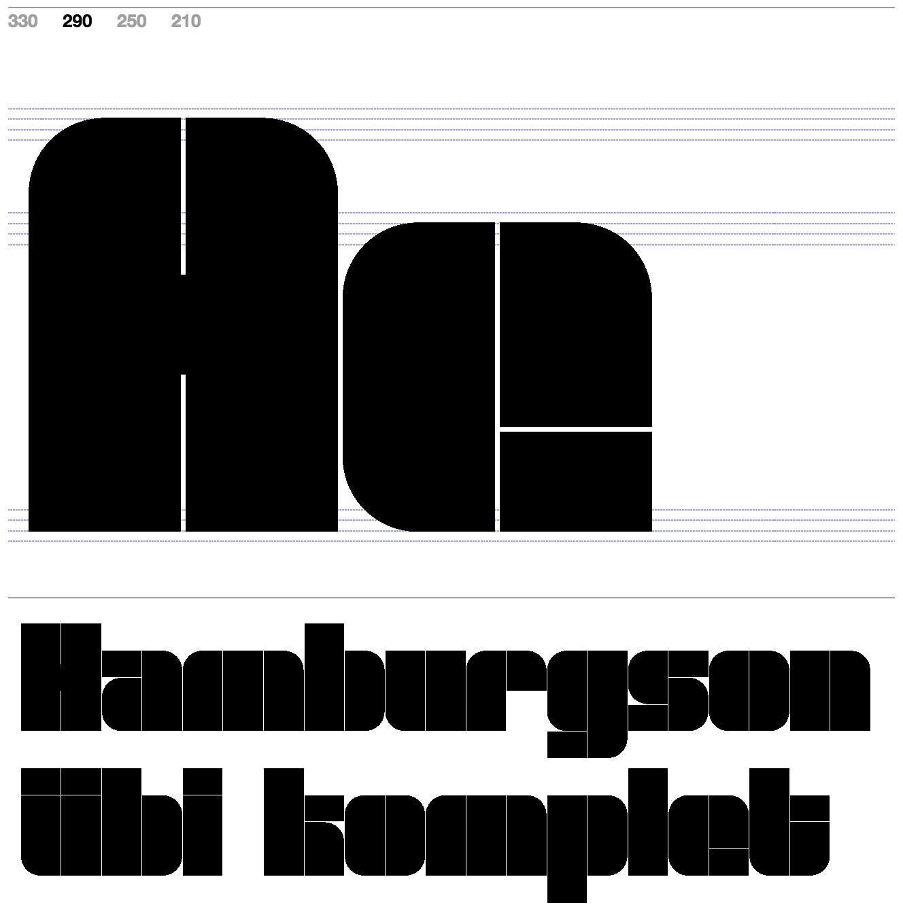

# Week 2
Our class started started with a short seminar on modular typeface designs, which ranged from the Bauhuas to contemporary designers working in algorithmic typography. Then it continued to our last group work this semester 😢 

## Typefaces
As I scroll down and search for modular typefaces, I came across this piece of work by MuirMcNeil. MuirMcNeil's particularly caught my eye with his 'Five' series of stencil type systems. The Five series was made in 2017 and it is constructed from basic geometric segments.

## Wholesome Animal Crossing

## Remix
collaborative p5.js
