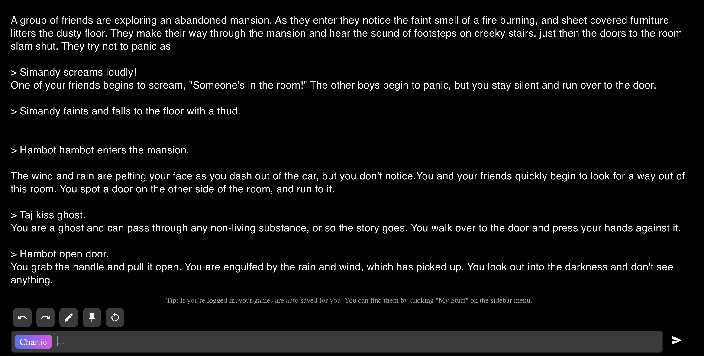

# Week 3 | Wot is Electronic Lit?
Week 3 started with an introduction to electronic literature. We discussed on a few case studies on avatars and virtual identities like Cindy Sherman, Mariko Mori, Stelarc. Then we shared our own research on the different types of electronic literature. In class I had an interesting discussion with Andy and Karen on deepfakes. I question if deepfakes is considered an electronic literature and their answer was yes. Deepfakes are a form of artificial intelligence called deep learning to make images of fake events. However, in the context of this class, I didnt deeply researched about them as it can get very political and negative.

To see our research on electronic literature click [here](https://docs.google.com/presentation/d/1QXcxFkKdzMiwNWBSdXT0LG9YNFjlzViwScTtsLMXROo/edit#slide=id.g8e5317bdfc_0_33).

## AI Dungeon
As a whole class we joined AI Dungeon which is a an infinitely generated text adventure powered by deep learning. It was my first time trying out this and it was pretty chaotic and I was impressed on how fast they generated texts. Most of the students had their own ideas of what story they wanted to tell and we think it became overloaded.

## WIP Brief 2
This week we gathered outside of class to divide roles and break down part 3 from House of Leaves. We worked colloboratively through Google Docs and stayed connected by Facebook. As we did some research, we came across a video made by Evil Imp and I thought it was inspiring. We aimed to re-create part 3 as well as they did because their cinematography was amazing!
Check them out [here!] (https://www.youtube.com/watch?v=xXc_9ikGkl0)

