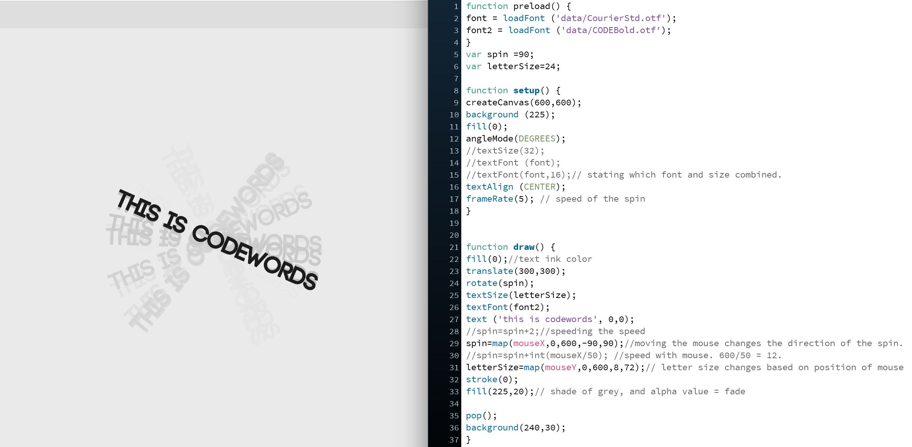

# Week 4

## p5.js
Week 4 was focused on how to introduce typography to our sketch. The functions we used were the preload and the loadFont, as well as related type functions to position words on the page. Then Karen then taught us the spinning movement that is linked to the mouse coordinates of mouseX and mouseY.

As we go deeper in learning how to use Github, Andy demonstrated how to add a folder, upload files, and organise these into a record of our learning. I felt quite overwhelmed in using Github as it is pretty new to me. Still struggling however I'm sure I would get a hang of it.

## Building Scenes
We continued to work on our group assignment and started building scenes in one of our islands. The limitations on this game is that we couldnt build at the same time. Only the owner of the island could rearrange items. So we decided to work collaboratively by sending some items to the host island to borrow. Other issues came up as we tried to meet in one island such as getting kicked off the island due to terrible connection. 

