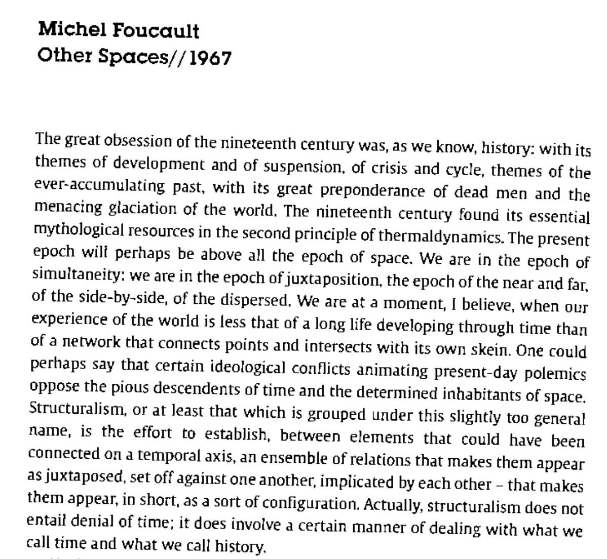

# Week 6 | Paper Prototypes
This week we started building paper prototypes of retro 2D video-games in small groups. Our group chose a game called 'Parking Panic'. The goal of this game is to move the main car to the exit. By doing that, we have to move the other cars and trucks out of the way (forward or backwards) so that you can reach it. 

## Pseudocode
We got introduced to pseudo-code and developing some of our daily habits. Last semester I did an elective called Make Things Interactive, and every project I started with, I needed to create a flow chart of the different possibilites that could happen. Pseudo-code reminded me of that activity. 

## 'Other Spaces'
In this week's class we started by noting the piece of critical theory or text which we have chosen to use in our major project. My chosen text is Other Spaces by Michel Foucault. It was an interesting text that open my mind on how space works, and a particular example he talked about was mirrors.
"The mirror is, after all, a utopia, since it is a placeless place. In the mirror, i see myself there where I am not, in an unreal, virtual space that opens up behind the surface;i am over there, there where I am not, a sort of shadow that gives my own visibility to myself, that enables me to see myself there where i am absent:such is the utopia of the mirror”. 

## Large Blocks of Text
We got to do some live coding session with Karen in the second half of the day. This time Karen introduced us on how to insert or [preload large blocks of text](https://natnathania.github.io/Codewords-2020/Processing/long_text/) in Processing.

#### [<- Week 5](https://github.com/natnathania/Codewords-2020/blob/master/Week%205/readme.md)

#### [-> Week 7](https://github.com/natnathania/Codewords-2020/blob/master/Week%207/readme.md) 
