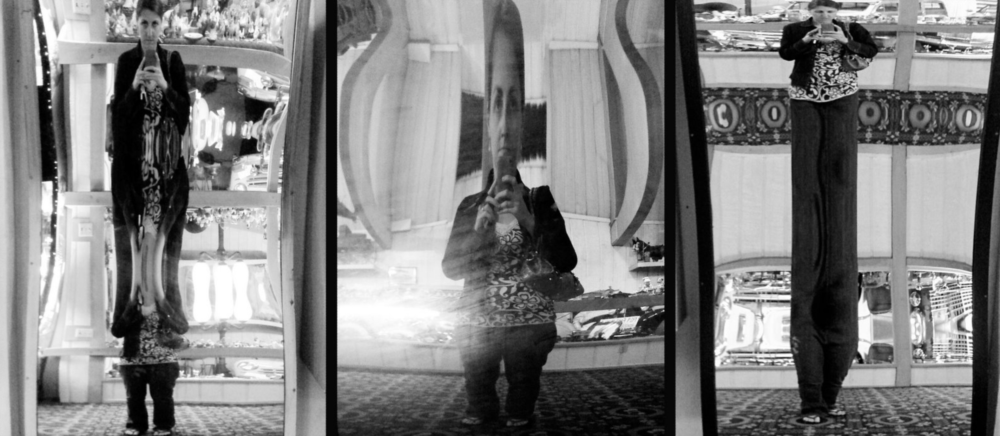

# Week 8 | My Concept Idea
My concept revovles on Foucault's text on mirrors as heterotopias. He discusses how our reflection on mirrors is a joint experience, a unreal, virtual space that opens up behind the surface. A sort of shadow that gives our own visibility to ourself, that enables us to see ourselves there where we are absent. With this in mind, I thought of this reality to be really distored. I had an imagination on mirrors in circuses where the reflection of ourselves would make us look funny. Then I thought it would be really great to do that with text. So with a combination of reflection and distortion happening at once, I wanted to express the idea on how our reflection might not be how we actually look like.

## Geomerative Library
When I pitched my idea to Andy and Karen, Karen mentioned how I would be able to distort my text by playing with anchor points. She then introduced me to the Geomerative library. Geomerative is a library for Processing. It extends 2D geometry operations to facilitate generative geometry. Includes a TrueType font and an SVG interpreters. This library exposes the shapes (such as vector drawings or typographies) in a more approchable way. Geomerative makes it easy to access the paths, the handles and the points, making it easy to develop generative typography and geometry pieces in Processing.

## Wiggly Letters
 

In our live-coding session with Karen, we got introduced in calling a class within our sketch. How I understood what a class is, a class is like a bucket where we can control individual letters in that bucket. I was quite confused how to write a class because it got pretty complicated for me, but Karen helped explain to us a little bit more and it was another milestone that we went through. 

#### [<- Week 7](https://natnathania.github.io/Codewords-2020/Week%207/)
#### [Week 9 ->](https://natnathania.github.io/Codewords-2020/Week%209/)
