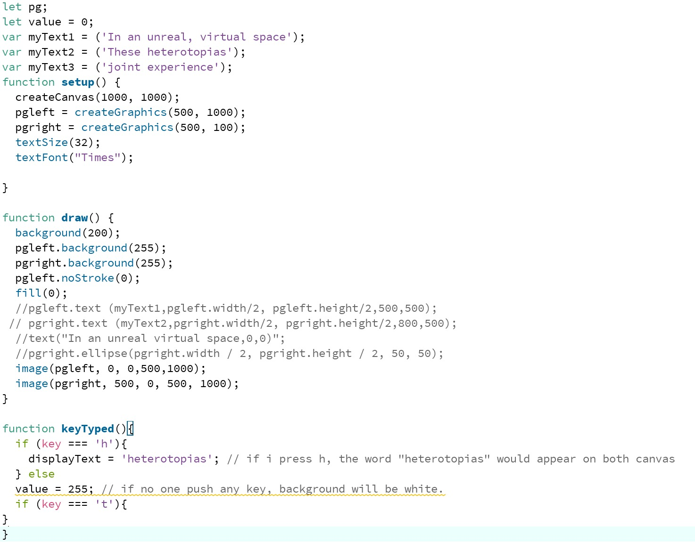

# Week 9 | Research

mirroring: https://editor.p5js.org/kan352/sketches/BkMtGLIJx , https://editor.p5js.org/ly1210/sketches/HktdECdnQ
examples of unreadable text: https://www.openprocessing.org/sketch/813395 , https://www.openprocessing.org/sketch/879647
blur: https://www.openprocessing.org/sketch/623979?fbclid=IwAR3rSg1jXTHEEQKTMbzbROrZbFevE4UwME4kAVov68YMnl3z9imw6uw8uOs
textToPoint: https://p5js.org/reference/#/p5.Font/textToPoints
Translation: https://github.com/processing/p5.js/wiki/Processing-transition

## Typing...

Ive been working on creating different canvases and displyaing text on each canvas.
