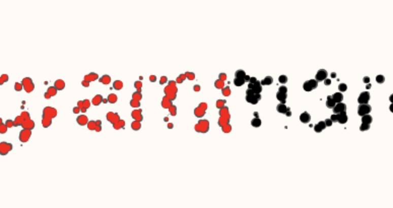
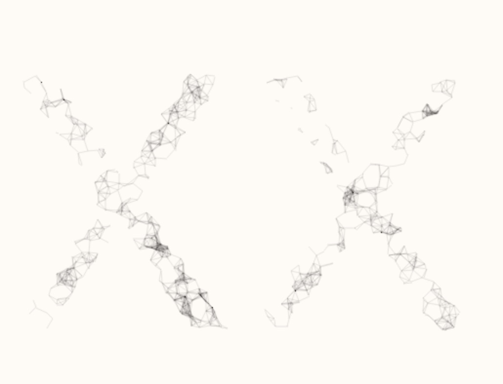
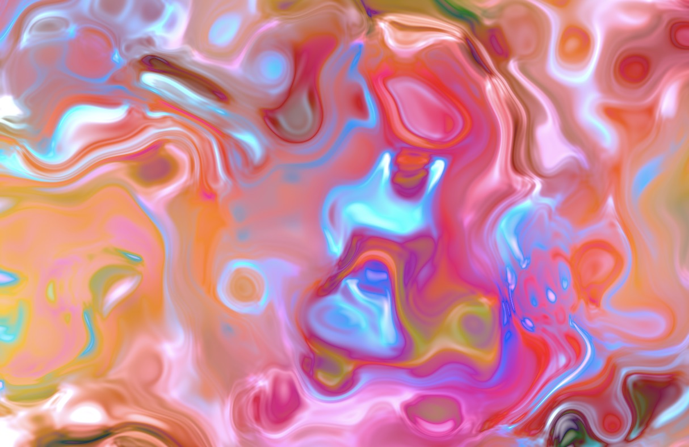
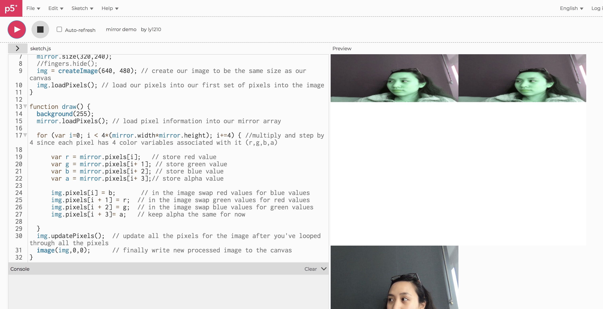
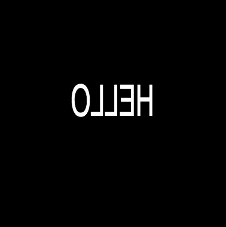
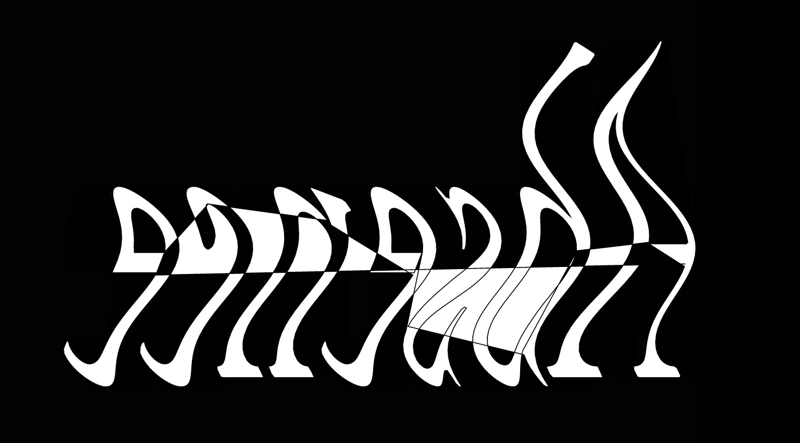

# Week 9 | Research
This week I started looking for inspiration on how I can express my concept. I first went to Open Processing and searched on the different possibilites of outcomes on typography. These are few examples I found on unreadable text (distortion and blur):

 

Since Open Processing is written in Java, I would need to translate the functions into Javascript and Karen and Andy shared a great link that would help me do this. 
[Translation](https://github.com/processing/p5.js/wiki/Processing-transition)

As I keep on digging for inspiration, the p5js website had some sketch examples that were great on mirroring and flipped canvases. This helped me figure out how to flip and canvas by scaling it.

 

Karen gave a reference that could help me create my own distortion by using the [textToPoint](https://p5js.org/reference/#/p5.Font/textToPoints) function. This code creates a wavy movement of the letters that suits my concept of distortion in a reflected mirror.

## Typing...

Ive been working on creating different canvases and displyaing text on each canvas. Since I want to use the keyTyped function, I tried to figure out how a sentence would appear if the user types a letter.

I've gathered the words and phrases of each letters that can be typed by the user. These words and phrases are linked to the idea of a utopia and heterotopia.

A – absence

B – Believe

C – counteraction

D – Direct of inverted

E – External space

F – Fundamentally unreal

G – Given society

H – Heterotopias

I – I see myself 

J – Joint experience

K – Kind of utopia

L – Look at myself

M - Mirror

N – No real place

O – Own visibility

P – Placeless place

Q – Quality

R – reality

S – Shadow

T – There where I am not

U – Utopias

V – Virtual space

W – Which we live

X – 

Y – You and I

Z - 

## Typeface
Then in considering the typeface for my project, I wanted an elegant but also creepy kind of typeface. The final decision is Mrs. Eaves as it works really well when the words starts moving.

