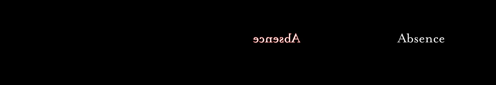

# Week 10 | Milestone
This week we had a short and quick presentation of our code-in-progress. This was another milestone for us to show what we have been working on. It was also an opportunity to ask help and offer some advices to other stuents. Click [here](https://docs.google.com/spreadsheets/d/1rqOlmfpCzXC9kA_vBeLOcTpdxCvWeo4zsiNa4uiDHTY/edit#gid=0) to see our spreadsheet that compiled our code-in-progress, a screenshot of our hero image, link to our github and a working sketch.

My code with the keyTyped function and flipped canvas works smoothly, however some letters didnt work for some reason. To go to another step of coding, I am trying to distort the text with the textToPoint function however since I am using multiple canvases, I couldnt figure out how to do it. Went through multiple trials but the textToPoint function wouldnt work. However, I got to a point where I had points around my text and from here I could move these points to create the wavy movement.

