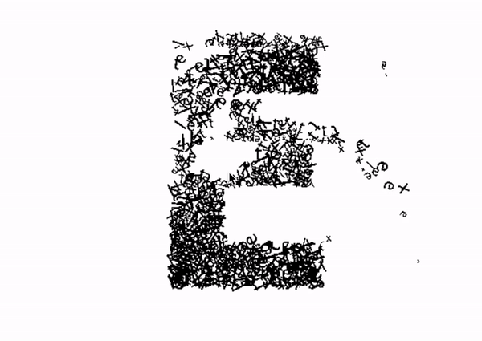
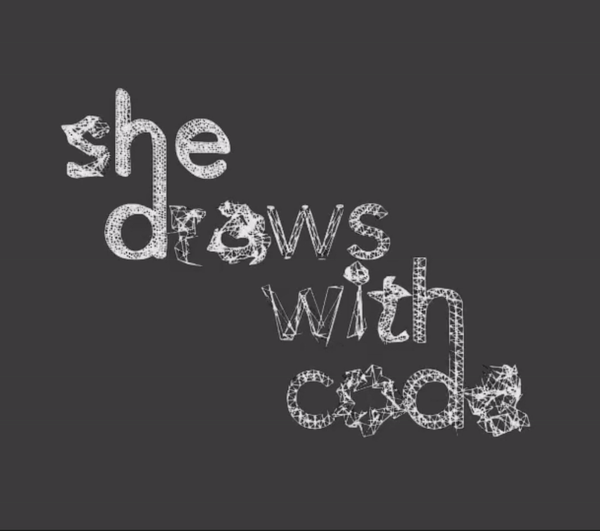

# Week 11 | Debugging

Before class I got the chance to ask some help from Jamie to further develop my project. Last week I had trouble with distorting my text with the textToPoint function on only my left canvas. Jamie helped me understand the function within my sketch. It was more complicated than I thought since I had multiple canvases working at the same time. We got to stage where the distorting on the left canvas works. However it only works once, meaning the next key typed wont work, leaving a black screen. This was a road block for me.

Thankfully Karen helped my disect the existing sketch that I worked on and got the distortion to work! (you are amazing Karen!) 
[On Progress Code](https://natnathania.github.io/Codewords-2020/Processing/Week_11onProg_majorproject/)

In class Andy gave some feedback to "iron out the kinks". There were small bugs to fix such as some letters associated to a phrase in the keyTyped function wouldn’t work. It turned out there was a typo (as always :/). Also, the position of the text on the left canvas kept on changing throughout different phrases. 

Within this week I further refined the sketch by controlling the the vertex function. This lets me adjust the speed and the amount of waves it would make. Another change I made was how much trail effect I wanted by changing the amount of sampleFactor on the textToPoint function.

## Typeface
Then in considering the typeface for my project, I wanted an elegant but also creepy kind of typeface. The final decision is Mrs. Eaves as it works really well when the text starts moving.

## Creative Coders | Patrik Huebner | Jessica In  
I found 2 creative coders who are doing similar things to me and projects that works with typography.

[Patrik Huebner](https://www.patrik-huebner.com/portfolio/) is a creative coder who is driven by the question how the mixture of data, human interaction, artificial intelligence and storytelling can transform the impact of communication design. By applying new and cutting edge techniques of creativity to his work with generative design systems and programming languages, he research emerging opportunities for brands and agencies to set themselves apart by leading future conversations.

His project called EX8 is generative typographic experiments, based on a simulated 2D physics models. This reminded me on other students work that plays around with physics in their sketch. To know more about his work click [here](https://www.patrik-huebner.com/portfolio-item/ex8/) 

[Jessica In](https://www.jessicain.net/) is a female creative coder that I found in Instagram. Originally from Melbourne Australia she is also an architect, designer, with experience as both practitioner and university educator. She is currently pursuing her interests in drawing, robotics and machine learning for interactive design explorations. Most of her work are visual experiments on generative design and also on experiments on typography. Her designs reminded me of the artists that I was exposed to last year in Slave to the Algorithm. She uses Processing, Python and Blender to create some of her work.

This work of hers is similar to the things we are doing in class. It looks like she plays around with the textToPoint function or the geomerative library. Her work are amazing!

#### [<- Week 10](https://github.com/natnathania/Codewords-2020/blob/master/Week_10/readme.md)
#### [Week 12 ->](https://github.com/natnathania/Codewords-2020/tree/master/Week_12)
