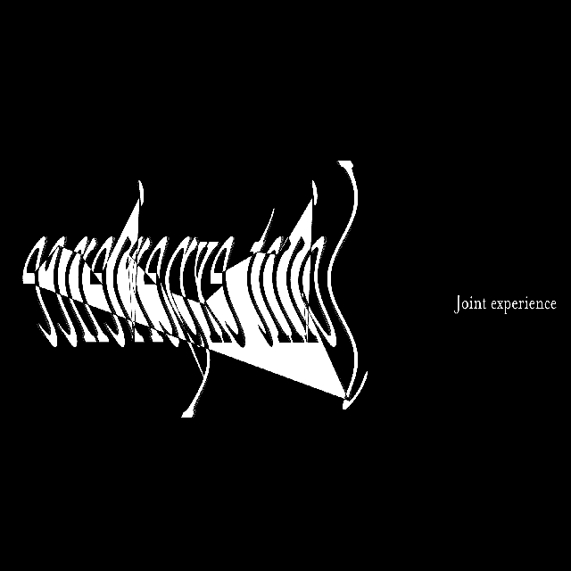

# Week 12 | The End
The night before our last class, I had the time to think about what I would name this project. The word mirage came into my mind as I was thinking about the concept of mirrors. Mirage means an optical illusion caused by atmospheric condition or an unrealistic hope or wish that cannot be achieved. I felt like my concept of heterotopias and mirrors is well suited to the definition of a mirage. So I named it Mirage.

I also ask for some feedback from friends. They gave me assuring statements about my work and said it was 'groovy'. Also as I was writing my statement I felt that time went by so quickly and we're already in week 12! So bittersweet!

## | Soft Launch
In this week we dedicated the first half of the class in making materials we needed for our major project showcase, such as animated GIFs, hero image and statements. Once we gathered all of them we had our soft launch on our major project, and it was really nice to see what everybody had done. So much amazing work and talented creative coders in this bunch. Many of us started from the basics and now they seem to be flying off the roofs with their skills! So proud of all them :) To visit our showcase website click [here!](https://simandy.github.io/codewords/) 

View my final project [here](https://natnathania.github.io/Codewords-2020/Week_12/Mirage/)

## Reflection

